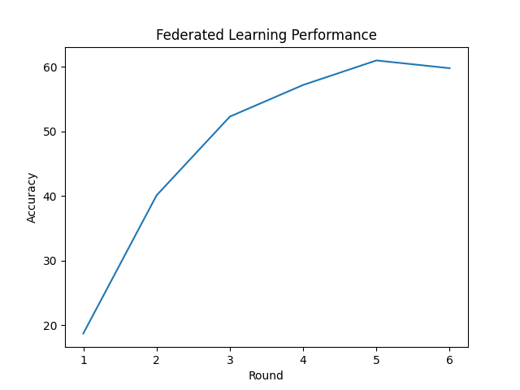

# Federated Learning Setup for Image Classification


## Overview

This project demonstrates a federated learning setup for training 
an image classification model. 
Federated learning allows multiple decentralized devices to collaboratively 
train a model while keeping the data localized on each device, 
thus enhancing privacy and security. My ultimate motive is to develop
personal food tracking application using this process.

## Features

- **Federated Learning Framework:** Implements a federated learning approach for image classification in PyTorch.
- **Image Classification Model:** Utilizes a neural network model for classifying images 
  (Mobilenet v2 suitable for edge device simulation).
- **Data Privacy:** Ensures data remains on local devices during training.
- **Scalability:** Supports training across multiple devices.

## Dataset

This project uses the CIFAR-10 dataset for image classification tasks. The CIFAR-10 dataset consists of 60,000 32x32 color images in 10 different classes, with 6,000 images per class.

```bash
@TECHREPORT{Krizhevsky09learningmultiple,
author = {Alex Krizhevsky and Geoffrey Hinton},
title = {Learning multiple layers of features from tiny images},
institution = {},
year = {2009}
}
```

For more information on the CIFAR-10 dataset, please visit the [CIFAR-10 website](https://www.cs.toronto.edu/~kriz/cifar.html).


## Installation

1. **Clone the Repository:**
    ```bash
    git clone https://github.com/nnn007/federated-learning-setup.git
    cd federated-learning-experimentation-cifar-setup
    ```

2. **Install Dependencies:**
    ```bash
    pip install -r requirements.txt
    ```

## Usage

1. **Download and prepare the CIFAR-10 Dataset:**
    - Ensure your image dataset is in the appropriate format and located in the specified ./data directory.

2. **Start the Federated Learning Process:**
    - First start the central server which will be hosting the central (base) model
    ```bash
    python central_server.py
    ```
    - Then run simulation file to simulate training across edge devices
    ```bash
    python simulation.py
    ```
    - Run the visualizer script to get a graph of model performance progress
    ```bash
    python visualizer.py
    ```

## Contributing

Contributions are welcome to improve the project as I'm just getting started! 
Please follow these steps:

1. **Fork the Repository**
2. **Create a New Branch**
    ```bash
    git checkout -b feature-branch
    ```
3. **Commit Your Changes**
    ```bash
    git commit -m "Add new feature"
    ```
4. **Push to the Branch**
    ```bash
    git push origin feature-branch
    ```
5. **Create a Pull Request**

## License

This project is licensed under the MIT License. See the [LICENSE](LICENSE) file for details.

## Contact

For any questions or suggestions, please open an issue or reach out to us at [nayan.nilesh@gmail.com](mailto:nayan.nilesh@gmail.com).
